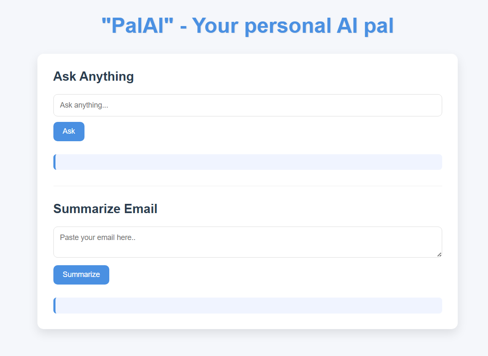
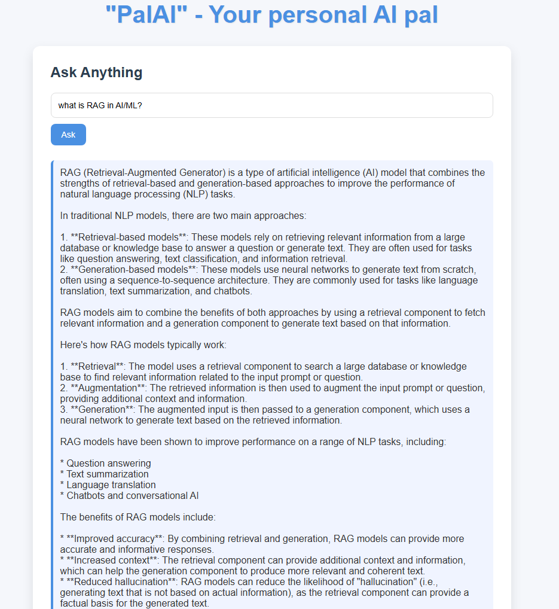
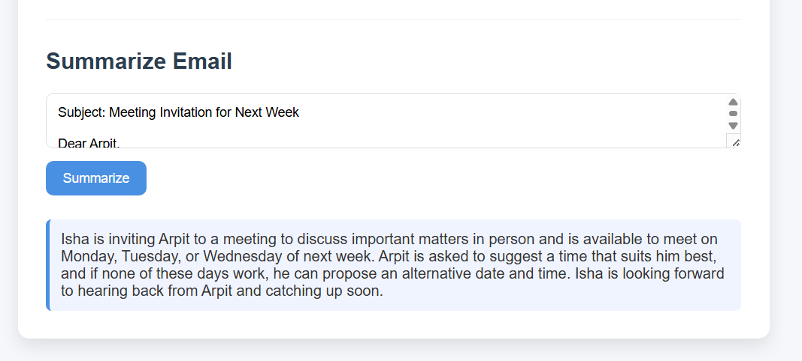

# "PalAI" - Your personal AI pal

A lightweight Flask project that turns your browser into a personal AI assistant. Users can ask questions in plain language or paste email text to get an instant AI-powered summary using OpenAI Groq.

## Demo

### Main Interface


### Ask Anything


### Summarize Email



## What this project does

- Hosts a Flask web app with a clean single-page UI
- Provides a chat-style prompt for asking anything
- Provides an email summarization tool for fast digestible output
- Uses `.env` for sensitive API config
- Uses the OpenAI Groq API via the official OpenAI Python client

## Key features

- `Ask Anything` form for conversational AI responses
- `Summarize Email` form for summarizing email text in 2-3 sentences
- JavaScript frontend that submits forms with `fetch()` and shows responses without page reload
- Simple responsive UI using `static/style.css`
- Environment-based API key loading with `python-dotenv`

## Tech stack

- Python 3
- Flask
- OpenAI Python client
- python-dotenv
- HTML, CSS, JavaScript

## Project structure

```text
.
├── README.md
├── .gitignore
├── main.py
├── .env
├── static/
│   └── style.css
└── templates/
    └── index.html
```

## How it works

1. `main.py` creates a Flask app and loads environment variables from `.env`
2. The homepage renders `templates/index.html`
3. User fills the `Ask Anything` or `Summarize Email` form
4. JavaScript sends a `POST` request to `/ask` or `/summarize`
5. Flask calls OpenAI Groq through `OpenAI.responses.create()`
6. The response is returned as JSON and displayed instantly on the page

## Setup instructions

1. Clone the repo:
   ```bash
   git clone https://github.com/<your-username>/<repo-name>.git
   cd <repo-name>
   ```

2. Create a Python virtual environment:
   ```bash
   python -m venv venv
   .\venv\Scripts\activate
   ```

3. Install dependencies:
   ```bash
   pip install flask python-dotenv openai
   ```

4. Create a `.env` file with your API key:
   ```env
   API_KEY_GROQ=your_api_key_here
   ```

5. Run the app:
   ```bash
   python main.py
   ```

6. Open your browser to:
   ```
   http://127.0.0.1:5000
   ```

## Usage

- Use the top input to ask general questions and receive AI-generated answers.
- Use the second textarea to paste an email and get a short summary.
- The page updates dynamically without a full reload.

## Non-technical details

This project is designed for learners and early-stage developers who want a simple real-world Flask app that integrates AI.

- Ideal for demonstrating how backend Python and frontend JavaScript work together
- Great for showing a portfolio project with AI functionality
- Includes clean code structure and self-explanatory comments

## Why this project is useful

- Shows how to build a real AI assistant with minimal code
- Demonstrates secure handling of API keys with `.env`
- Teaches how to connect frontend forms to backend APIs using `fetch()`
- Provides a nice example of using Flask templates and static assets

## Security note

Do not commit your `.env` file or API key to GitHub. The repository’s `.gitignore` already excludes `.env` and Python cache files.

## Future improvements

- Add user authentication
- Save chat history to a database
- Add error handling for failed API calls
- Improve UI with better styling and mobile layout
- Add actual deployment support for Heroku, Railway, or Fly.io

